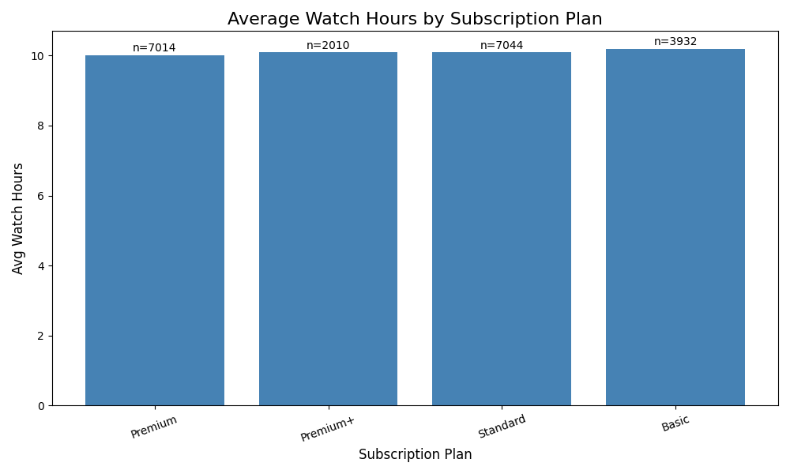
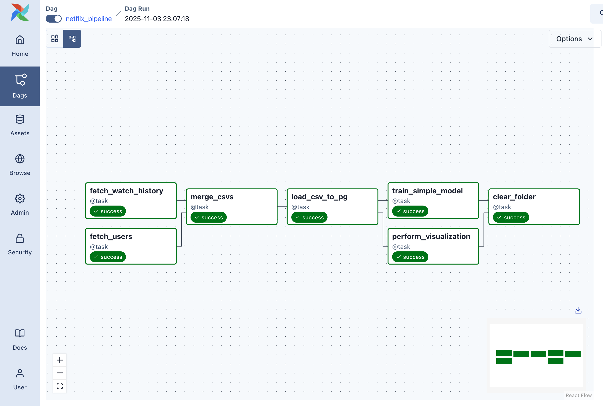

# 🎬 Netflix User Engagement Data Pipeline Using Apache Airflow

## Project Overview

This project builds an end-to-end data engineering pipeline using Apache Airflow to process user engagement data from a Netflix dataset sourced from Kaggle. The pipeline automates data ingestion, cleaning and standardization, transformations, merging, loading into PostgreSQL, training a simple machine learning model, creating a visualization of watch-time patterns based on subscription behavior, and cleaning up intermediate steps.


## Dataset Description

The pipeline uses two files from the Netflix 2025 User Behavior Dataset (210K records) on Kaggle (found in data folder):
1. `users.csv` – User demographics, subscription plan, region, monthly spend, etc.
2. `watch_history.csv` – Session-level watch duration, completion rate, and device information

Kaggle source: https://www.kaggle.com/datasets/sayeeduddin/netflix-2025user-behavior-dataset-210k-records/data


## Pipeline Architecture (DAG)

DAG ID: `netflix_pipeline`
Schedule: One-time execution (@once)
Orchestration:
- Users data and watch history data are processed in parallel
- Merged before loading to PostgreSQL
- Visualization and model training run after loading


**1. Data Ingestion and Cleaning with `fetch_users`**

Cleans and standardizes user attributes:
- Normalizes column names using a _pick() function (handles variants like userId, userid, etc.)
- Removes outliers (e.g., age < 5 or > 100, monthly spend > $1000)
- Drops duplicate users

**2. Data Ingestion and Cleaning with `fetch_watch_history`**

Aggregates raw session-level watch data:
- Converts minutes to hours
- Removes extreme binge-watching outliers (>13 hrs/day)
- Standardizes completion rate (0–1 scale)
- Aggregates to user-level based on total watch hours and average completion rate


**3. Data Integration with `merge_csvs`**

Merges cleaned user data and aggregated watch history on user_id:
- Ensures numeric fields are properly typed
- Creating a unified dataset for further analysis


**4. Database Loading with `load_csv_to_pg`**

Loads merged data into PostgreSQL:
- Creates table dynamically based on CSV columns
- Creates schema automatically if missing

**5. Predictive Modeling with `train_simple_model`**

This step trains a Logistic Regression model to predict whether a user is active (1) or churned (0) using watch_hours

This task:
- Pulls data from PostgreSQL
- Cleans values + drops NaN/inf
- Stratifies train/test split for balanced labels
- Computes accuracy

**6. Analysis plots with  `perform_visualization`**

Generates a single meaningful bar chart for Average Watch Hours by Subscription Plan (with sample size labels on each bar). Output is saved as `analysis_plot.png` in the data folder. This chart helps understand how different subscription plans correlate with user engagement.


**7. Cleanup in `clear_folder`**

Removes intermediate CSVs after pipeline completion to maintain a clean workspace.


## Results and Findings

**Model Insights:**

The Logistic Regression model predicts user activity (churn) using only watch hours. Airflow logs show: “Model trained with accuracy: 0.85.” In other words, using watch time alone gives an about 85% accuracy at separating active vs. churned users for this snapshot of data.
The accuracy of  reflects how strongly engagement signals relate to churn. This should be viewed as a baseline because it’s a one-feature model. We would expect improved accuracy by adding more signals (e.g., completion rate, recency of viewing, region, etc).

**Visualization Insights:**

The final bar chart highlights mean total watch hours by subscription plan with sample sizes on each bar. However, we can see that engagement is very similar across plans. We can conlcude that plan tier doesn’t strongly drive watch time in this dataset. If the goal is to increase activity or reduce churn, we could possibly look at behavioral features like content affinity or recent activity patterns which may be more impactful than subscription plan alone.




## DAG Execution





## Implementation Information

### Key Technologies

- Apache Airflow — workflow orchestration
- PostgreSQL — data warehouse layer
- Pandas — cleaning, transformation, data manipulation
- Matplotlib — visualization
- scikit-learn — logistic regression model
- Docker Compose — reproducible environment


### Quick Start

**Prerequisites:** 
- Docker + Docker Compose installed
- Airflow environment running
- CSVs placed inside data folder
- Access to a PostgreSQL database

**How to Run**
1. Start Airflow:

```bash
cd .devcontainer
docker compose build --no-cache
docker compose up -d
```

2. Open the UI http://localhost:8080 and trigger the DAG `netflix_pipeline`

3. Monitor each task’s logs for progress

4. Review generated outputs and logs

## Conclusion

This project demonstrates how Apache Airflow can be used to automate and orchestrate a full data pipeline—from ingestion and cleaning to machine learning and visualization—using Netflix engagement data. Through this workflow, we gain insights into how subscription plans relate to watch behavior and churn, and how automated pipelines streamline real-world data engineering tasks.